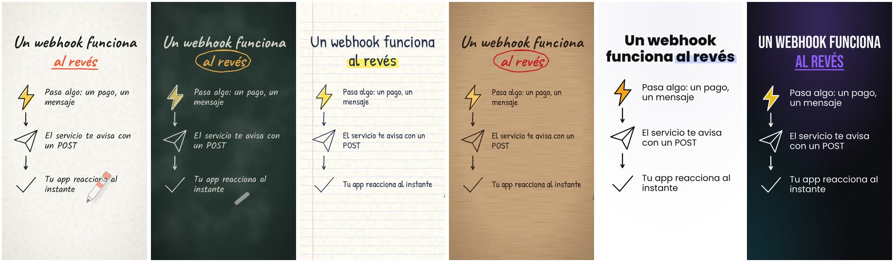

# animaciones-video 🎬✏️

Skill para **Claude** que crea animaciones por código listas para usar en tus videos: escenas explicativas estilo pizarra que se escriben solas, tipografía cinética, listas, cifras que cuentan, gráficas, comparaciones, capturas señaladas, una mascota que actúa, rótulos (*lower thirds*), subtítulos karaoke y transiciones con fondo transparente.

Todo se genera con código (SVG + GSAP), se renderiza cuadro por cuadro con Chromium y sale en el formato que tu editor necesita: **MP4** (9:16, 16:9, 1:1, 4:5), **MOV ProRes 4444 / WebM con transparencia**, **PNG** o **GIF**, con efectos de sonido sintetizados.




## Qué puedes pedirle

- *"Hazme un reel de 40 segundos explicando qué es un webhook, estilo pizarra, con mascota."*
- *"Necesito un rótulo con mi nombre y cargo para poner encima de mi video de YouTube."*
- *"Anima estas tres cifras de mi reporte (te paso la fuente) en 16:9, estilo minimal con mis colores #0F766E y #F59E0B."*
- *"Subtítulos karaoke para este .srt."*
- *"Dame 4 transiciones en tono kraft para mis cortes."*

Claude entiende el pedido, te muestra un guion corto, arma el clip, revisa fotos de cada escena y renderiza.

## Instalación

### Requisitos (una vez)
- **Node.js 18+** → https://nodejs.org
- **ffmpeg** → Mac `brew install ffmpeg` · Windows `winget install ffmpeg` · Linux `sudo apt install ffmpeg`
- El primer uso instala Chromium con `npx playwright install chromium`.

### En Claude Code
```bash
git clone https://github.com/<tu-usuario>/animaciones-video.git ~/.claude/skills/animaciones-video
```
Abre Claude Code y pídele una animación. También puedes invocarlo con `/animaciones-video`.

### En Claude (claude.ai / app)
1. Descarga `animaciones-video.zip` desde **Releases**. (Si armas el ZIP tú mismo, la carpeta de adentro debe llamarse exactamente `animaciones-video` y contener `SKILL.md`; el botón *Download ZIP* de GitHub la llama `animaciones-video-main`, así que renómbrala antes de comprimir).
2. Ve a **Customize → Skills → + → Create skill → Upload a skill** y sube el ZIP.
3. Necesitas tener activado *Code execution and file creation*. Más info: [Use skills in Claude](https://support.claude.com/en/articles/12512180-use-skills-in-claude).

## Úsalo sin Claude (manual)
```bash
cp -R template/. mi-proyecto/ && cd mi-proyecto
npm install && npx playwright install chromium
node preview.mjs clips/ejemplo-explicativo.js           # vista previa en el navegador
node render.mjs clips/ejemplo-explicativo.js --escenas  # fotos de revisión
node render.mjs clips/ejemplo-explicativo.js            # video final → salida/
```
Un clip es un archivo `.js` con una lista de escenas:
```js
export default {
  nombre: 'mi-reel', formato: '9:16', estilo: 'pizarra',
  escenas: [
    { tipo: 'titulo', texto: '¿Sabías esto?', resalta: 'esto', mascota: 'saludar' },
    { tipo: 'cifra', valor: 73, sufijo: '%', etiqueta: 'de algo real', fuente: 'Tu fuente' },
    { tipo: 'cta', texto: 'Sígueme para más' },
  ],
};
```

## Qué incluye

| | |
|---|---|
| **15 tipos de escena** | `titulo`, `idea`, `flujo`, `lista`, `cifra`, `barras`, `comparacion`, `cita`, `imagen`, `mascota`, `cta`, `rotulo`, `subtitulos`, `transicion`, `personalizada` |
| **6 estilos** | pizarra (plumón), pizarrón (tiza), cuaderno (lápiz y marcatextos), kraft, minimal, oscuro — todos con tus colores, fuentes y logo |
| **42 íconos doodle** | se dibujan trazo a trazo ([ver hoja](docs/iconos.jpg)) |
| **Mascota original** | entra, saluda, señala, salta, piensa, celebra con confeti y habla con globo; o usa tu logo |
| **11 transiciones** | tinta, barrido, persiana, círculo, borrador, empuje, zoom, voltear… |
| **Exportación** | MP4, MOV ProRes 4444 y WebM con alfa, verde para chroma, PNG, GIF, pista de efectos `.wav`, marcas de escenas `.json` |
| **Determinista** | el mismo clip da siempre el mismo video; renderiza en paralelo |

Documentación para el agente (y para ti) en [`references/`](references): componentes, API del motor, estilos y marca, guion y ritmo, exportar, QA.

## Estructura
```
animaciones-video/
├── SKILL.md              # instrucciones que lee Claude
├── references/           # documentación detallada
├── template/             # proyecto que se copia para cada video
│   ├── engine/           # motor (navegador): escenas, texto, trazos, mascota, transiciones
│   ├── lib/              # render (Node): servidor, navegador, efectos de sonido
│   ├── clips/            # ejemplos
│   ├── render.mjs        # render a video / fotos de QA
│   └── preview.mjs       # vista previa en vivo
└── docs/                 # imágenes del README
```

## Créditos y licencias
- Idea inspirada en [santmun/video-pizarra](https://github.com/santmun/video-pizarra); este motor está escrito desde cero.
- [GSAP](https://gsap.com) (licencia estándar gratuita de GSAP), [Playwright](https://playwright.dev) (Apache-2.0) y fuentes de [Fontsource](https://fontsource.org) (SIL OFL) se instalan con npm; no se redistribuyen aquí.
- Código de este repositorio: [MIT](LICENSE) © 2026 Rommel Risco.
